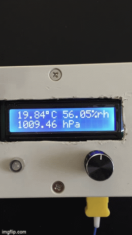

# Micropython tinkering

1. Tempreader project

- This folder contains `micropython` files for a temp-reader project that uses `uasyncio` widely.
- It runs on an ESP32, and includes BME280 temp, humidity, and pressure sensor (via I2C), Adafruit MAX 31855 thermocouple aplifier (via SPI), neo pixel,
rotrary encoder, 1602 LCD display (via I2C)
- Notably, it also uses the [aswitch](https://github.com/peterhinch/micropython-async) library by Peter Hinch. The pushbutton on the rotary encoder lets you switch (toggle) between two different display states:
 - (1) showing the output of the BME280 and (2) showing the output (current) temp of the thermocouple as well as the temperature set via the rotary encoder, as well as
 the delta and on the neopixel (as an alert of sorts) of how close you are getting to the set temp.

 

This is my first bigger micropython project with `uasyncio` and it works wonderfully, thanks in large part due to Peter Hinch's help. It is a little messy I'm sure
and there are certainly ways to implement this more elegantly. Feedback is welcome!

Schematic on EasyEDA [here](https://oshwlab.com/Primesty/thermo_couple_project_copy)

### Additional resources:

- Dave Hylands' LCD info - especially to create characters [here](https://github.com/dhylands/python_lcd)
- Adafruit SPI MAX 31855 thermo reader based on [this](https://cdn-learn.adafruit.com/downloads/pdf/micropython-hardware-spi-devices.pdf) doc.
- Rotary encoder lib [here](https://github.com/SpotlightKid/micropython-stm-lib/blob/master/encoder/encoder.py)
